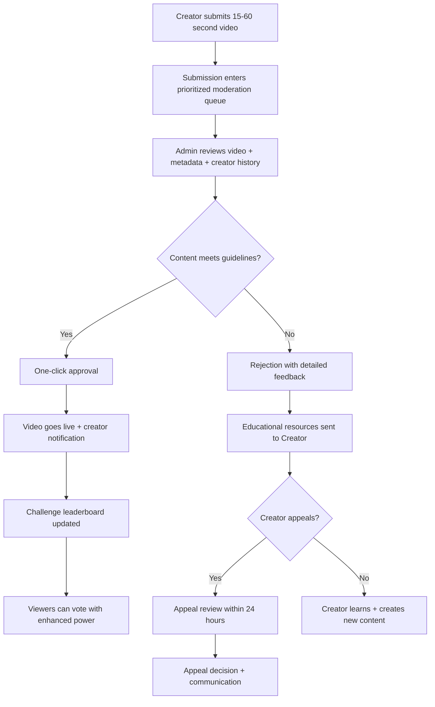
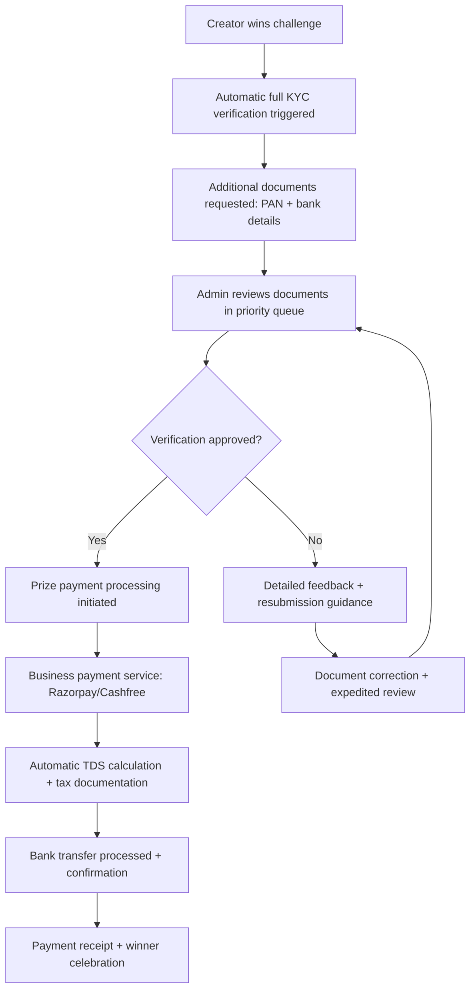
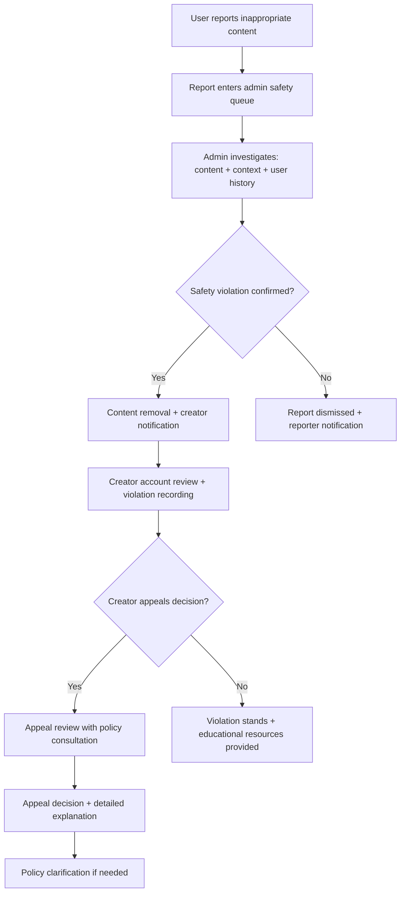
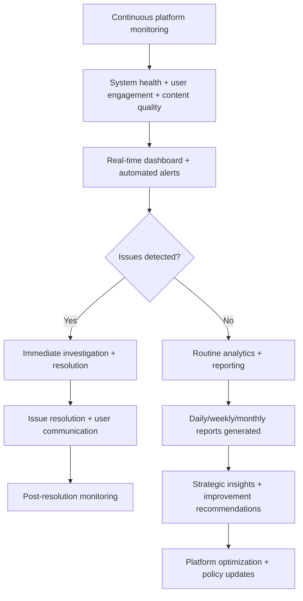
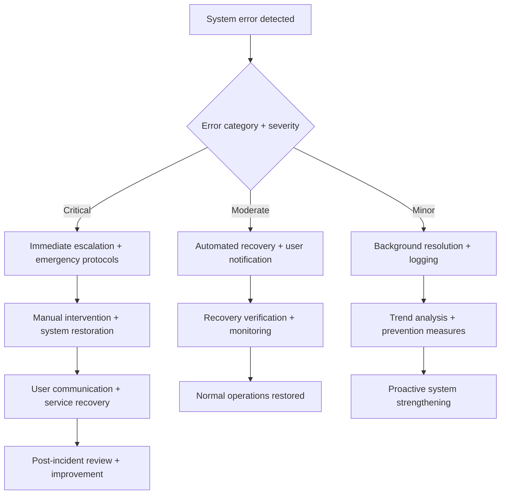

# Dvand - Admin User Stories & Workflows

## Admin Persona Overview

**Profile:** Platform administrators (3-person team) responsible for maintaining platform quality, ensuring compliance, and managing the creator ecosystem during Dvand's operational phase.

**Team Structure & Responsibilities:**

- **Lead Admin**: Content policy, creator relations, complex appeals, strategic decisions
- **Content Moderator**: Video review, bulk approvals, quality assurance, community guidelines
- **Operations Admin**: KYC verification, payment processing, technical support, platform monitoring

**Core Operational Capabilities:**

- **Content Moderation**: Review 200+ video submissions per weekly challenge (15-60 second videos)
- **User Management**: Process 10+ KYC applications daily with 24-48 hour turnaround
- **Challenge Administration**: Manage 2-3 concurrent challenges with fair winner selection
- **Financial Operations**: Prize disbursement, tax compliance, payment dispute resolution
- **Platform Oversight**: Monitor user engagement, system health, policy compliance

**Critical Success Metrics:**

- Content moderation: <2 hour average review time with >95% accuracy
- KYC processing: 24-48 hour turnaround with 100% compliance
- Prize disbursement: 5-7 business day processing with zero payment errors
- Platform uptime: 99.5% availability with proactive issue resolution
- Community satisfaction: <1% escalated complaints requiring intervention

---

## 1. Content Moderation & Approval (Priority 1)

### Efficient Video Review Pipeline

**US-AD-001**: As an admin, I want to view pending video submissions in a prioritized queue so I can efficiently review content before publication.

**Acceptance Criteria:**

- Moderation queue sorted by challenge deadline proximity and submission time
- Video thumbnail, title, creator info, and metadata visible at a glance
- Challenge context: theme, rules, current leaderboard position predictions
- Bulk selection capabilities for efficient batch processing
- Filter options: by challenge, submission date, creator verification status, content type
- Queue statistics: total pending, average review time, deadline urgency indicators
- Real-time queue updates as new *Creator* submissions arrive
- Estimated processing time remaining before challenge deadlines

**Cross-User Impact:** Efficient moderation ensures *Creator* content reaches *Viewers* quickly, maintaining engagement and fair competition

**US-AD-002**: As an admin, I want comprehensive video preview capabilities so I can make informed moderation decisions quickly.

**Acceptance Criteria:**

- Full-screen video player with standard controls (play, pause, scrub, volume)
- Standardized duration validation: 15-60 seconds with precise timing display
- Metadata display: title, description, tags (max 8), challenge association
- Creator profile summary: verification status, submission history, violation record
- Side-by-side community guidelines reference with violation examples
- Note-taking capability for complex decisions and policy clarifications
- Quick navigation: keyboard shortcuts for approve/reject/skip actions
- Batch review mode for processing multiple similar submissions efficiently

**Cross-User Impact:** Thorough review ensures high-quality content for *Viewer* engagement while maintaining fair *Creator* treatment

**US-AD-003**: As an admin, I want streamlined approval workflows so high-quality content goes live immediately.

**Acceptance Criteria:**

- One-click approval with automatic *Creator* notification (push + email)
- Bulk approval option for clearly compliant content with confirmation safeguards
- Approval triggers: immediate video publication, challenge leaderboard addition
- Automated *Creator* feedback: "Your video has been approved and is now live!"
- Approval metrics tracking: time-to-approval, batch processing efficiency
- Quality flagging: option to approve with featured content recommendation
- Audit trail: complete approval history with timestamp and admin identification

**Cross-User Impact:** Fast approval gets quality *Creator* content to *Viewers* quickly, maintaining platform engagement

**Error Handling - Approval Process:**

- Approval system failure: Manual backup approval with notification queue
- Notification delivery failure: Multiple channel retry (push, email, in-app)
- Leaderboard update errors: Manual verification with creator notification
- Batch processing interruption: Individual fallback with progress preservation

### Content Rejection & Educational Feedback

**US-AD-004**: As an admin, I want detailed rejection workflows so creators understand platform standards and can improve future submissions.

**Acceptance Criteria:**

- Rejection categories: Policy Violation, Quality Issues, Challenge Non-compliance, Technical Issues
- Specific violation selection with detailed reason templates and custom message fields
- Educational resource integration: relevant policy links, improvement tips, successful examples
- Creator notification: detailed email with specific feedback and improvement guidance
- Rejected video handling: moved to *Creator* draft folder with retention for resubmission learning
- Rejection analytics: trending issues, creator education needs, policy clarification requirements
- Severity tracking: warning system for repeat violations with escalation procedures

**Cross-User Impact:** Educational rejection feedback improves *Creator* content quality for better *Viewer* experience

**US-AD-005**: As an admin, I want efficient appeals management so creators have fair recourse for disputed decisions.

**Acceptance Criteria:**

- Appeal queue: chronological order with 24-hour response target
- Appeal context: original video, rejection reason, *Creator* appeal message
- Decision tools: side-by-side policy comparison, precedent reference, consultation options
- Resolution options: reinstate with apology, uphold with explanation, escalate for review
- Appeal communication: detailed response to *Creator* with clear reasoning
- Appeal analytics: overturn rate, policy clarification needs, moderation quality metrics
- Escalation protocol: WhatsApp support integration for complex cases

**Cross-User Impact:** Fair appeals process maintains *Creator* trust while ensuring consistent policy application

**Error Handling - Rejection & Appeals:**

- Appeal processing delays: Proactive creator communication with timeline updates
- Policy interpretation conflicts: Escalation to lead admin with precedent documentation
- Notification system failures: Alternative communication channels with confirmation tracking

---

## 2. Challenge Management (Priority 2)

### Challenge Creation & Configuration

**US-AD-006**: As an admin, I want comprehensive challenge creation tools so I can design engaging competitions that drive platform participation.

**Acceptance Criteria:**

- Challenge configuration: title, description, theme with creative guidelines
- Duration settings: weekly (7 days, ₹5,000) or monthly (30 days, ₹25,000) with precise timing
- Submission limits: standardized 2 videos per *Creator* per challenge
- Content requirements: 15-60 second duration, theme adherence, quality standards
- Eligibility criteria: verified *Creators* only, geographic restrictions if needed
- Prize structure: single winner (winner-takes-all) with ceremonial top 3 display
- Challenge banner: image upload with preview and social media optimization
- Advanced scheduling: multiple challenge pipeline with automated launch

**Cross-User Impact:** Well-designed challenges drive *Creator* participation and *Viewer* engagement

**US-AD-007**: As an admin, I want flexible challenge parameters so I can adapt competitions to platform needs and special events.

**Acceptance Criteria:**

- Challenge rules customization: specific content guidelines, hashtag requirements
- Judging criteria: Shor score weighting adjustments, manual override thresholds
- Submission timeline: deadline configuration with automatic closure
- Visibility settings: public, featured, or invite-only for special events
- Content restrictions: age-appropriate themes, cultural sensitivity guidelines
- Winner selection: automated algorithmic selection with manual review override
- Terms integration: automated terms of service association with challenge-specific clauses

**Cross-User Impact:** Flexible challenges maintain *Creator* interest while ensuring appropriate content for all *Viewer* types

### Active Challenge Monitoring

**US-AD-008**: As an admin, I want real-time challenge monitoring so I can ensure healthy participation and address issues proactively.

**Acceptance Criteria:**

- Live participation dashboard: submission count, *Creator* engagement, *Viewer* voting patterns
- Leaderboard monitoring: real-time Shor score calculation with position change tracking
- Engagement metrics: vote distribution, *Viewer* participation rates, content sharing statistics
- Quality assurance: submission quality trends, moderation approval rates, policy compliance
- Technical monitoring: system performance, upload success rates, payment processing status
- Alert system: low participation warnings, technical issues, policy violations
- Geographic analytics: participation distribution, regional engagement patterns

**Cross-User Impact:** Proactive monitoring ensures fair competition for *Creators* and engaging content for *Viewers*

**US-AD-009**: As an admin, I want challenge modification capabilities so I can adapt to circumstances and maintain fair competition.

**Acceptance Criteria:**

- Deadline extensions: justified extension with automatic *Creator* notification
- Prize adjustments: special occasion bonuses with transparent communication
- Rule clarifications: mid-challenge updates with retroactive fairness consideration
- Submission limit modifications: emergency adjustments with participant notification
- Emergency suspension: challenge pause with participant refund/compensation options
- Modification audit trail: complete change history with reasoning documentation
- Impact assessment: participant notification and fair treatment protocols

**Cross-User Impact:** Challenge modifications maintain fairness for *Creators* while preserving *Viewer* engagement

**Error Handling - Challenge Management:**

- Challenge launch failures: Automatic retry with backup scheduling systems
- Leaderboard calculation errors: Manual verification with participant notification
- Modification system failures: Fallback to manual processes with audit documentation

---

## 3. User Management & KYC Verification (Priority 3)

### Creator Verification Processing

**US-AD-010**: As an admin, I want efficient KYC review workflows so creators can participate in challenges with minimal delay.

**Acceptance Criteria:**

- KYC queue: priority-sorted by submission time with 24-48 hour processing target
- Document viewer: high-resolution display with zoom, rotation, and quality assessment tools
- Verification checklist: Aadhaar card validation, age verification (18+), identity matching
- Batch processing: multiple applications with streamlined approve/reject workflows
- Quality assessment: automated pre-screening with manual review for edge cases
- Approval workflow: instant *Creator* notification with dashboard access activation
- Rejection process: detailed feedback with specific document improvement guidance

**Cross-User Impact:** Efficient KYC processing enables *Creator* participation while maintaining platform safety for all *Viewers*

**US-AD-011**: As an admin, I want comprehensive winner verification so prize payments comply with financial regulations.

**Acceptance Criteria:**

- Winner verification trigger: automatic full KYC initiation upon challenge win
- Enhanced document requirements: PAN card, bank account details, address verification
- Financial validation: IFSC code verification, account holder name matching
- Tax compliance: PAN verification, TDS calculation preparation
- Document security: encrypted storage with audit trail and retention policies
- Processing timeline: 3-5 business day target with winner communication
- Payment preparation: seamless handoff to payment processing system

**Cross-User Impact:** Thorough winner verification ensures legitimate prize distribution while maintaining *Creator* trust

### Account Management & Safety

**US-AD-012**: As an admin, I want comprehensive user management tools so I can maintain platform integrity and handle user issues efficiently.

**Acceptance Criteria:**

- User search: comprehensive lookup by name, phone, email, username with advanced filters
- Profile management: complete user overview with verification status, activity history, violation record
- Account status control: active, suspended, banned states with reasoning documentation
- Verification management: badge assignment, expiry tracking, renewal workflows
- Account merger: duplicate account resolution with data preservation
- Activity monitoring: suspicious behavior detection, engagement pattern analysis
- Bulk operations: mass account management for policy enforcement scenarios

**Cross-User Impact:** Effective user management ensures platform safety for all *Viewers* while supporting legitimate *Creator* growth

**US-AD-013**: As an admin, I want user safety enforcement tools so I can protect the community while providing fair treatment.

**Acceptance Criteria:**

- Violation tracking: complete history with severity escalation and pattern recognition
- Blocking workflow: temporary and permanent options with clear documentation requirements
- Appeal management: user recourse process with fair review and decision communication
- Content removal: associated content handling with notification requirements
- Community protection: automated and manual safety measure implementation
- Rehabilitation process: path for users to regain good standing with clear requirements
- Legal compliance: documentation and reporting for regulatory requirements

**Cross-User Impact:** Safety enforcement protects all *Viewers* while ensuring fair treatment for *Creators*

**Error Handling - User Management:**

- Verification system failures: Manual backup processes with expedited review
- Account status conflicts: Automatic conflict resolution with audit trail
- Data integrity issues: Recovery procedures with user notification

---

## 4. Winner Selection & Prize Disbursement (Priority 4)

### Fair Winner Determination

**US-AD-014**: As an admin, I want transparent winner selection tools so I can ensure fair competition outcomes and community trust.

**Acceptance Criteria:**

- Final leaderboard review: complete Shor score breakdown with algorithm transparency
- Winner confirmation: single winner selection (winner-takes-all) with ceremonial top 3 display
- Manual override capability: discretionary judgment with clear documentation requirements
- Tie-breaking tools: standardized criteria with consistent application
- Eligibility verification: automated compliance checking with manual review option
- Winner announcement: coordinated communication with *Creator* consent and celebration
- Result documentation: complete audit trail with decision reasoning

**Cross-User Impact:** Transparent winner selection maintains *Creator* trust and *Viewer* engagement in fair competition

**US-AD-015**: As an admin, I want comprehensive winner eligibility verification so only qualified creators receive prizes.

**Acceptance Criteria:**

- Automated eligibility check: KYC status, challenge compliance, policy adherence
- Violation review: complete submission history with policy compliance verification
- Age and geographic verification: regulatory compliance with legal requirements
- Submission compliance: 2-video limit verification with gaming prevention
- Disqualification workflow: clear process with next-in-line winner promotion
- Documentation requirements: complete reasoning with appeal process information
- Precedent tracking: consistent application of eligibility criteria

**Cross-User Impact:** Rigorous eligibility verification ensures legitimate *Creator* wins while maintaining platform credibility

### Prize Payment Processing

**US-AD-016**: As an admin, I want efficient prize payment systems so winners receive rewards promptly and accurately.

**Acceptance Criteria:**

- Payment initiation: automated workflow trigger with manual confirmation capability
- Business payment service integration: Razorpay/Cashfree Payouts with TDS automation
- Payment verification: bank account validation with multiple verification methods
- Tax compliance: automated TDS calculation with proper documentation
- Processing timeline: 5-7 business day target with milestone notifications
- Payment confirmation: receipt generation with transaction reference numbers
- Audit trail: complete financial documentation for compliance and transparency

**Cross-User Impact:** Reliable payment processing maintains *Creator* trust and platform reputation

**US-AD-017**: As an admin, I want payment monitoring and dispute resolution so I can handle financial issues quickly and fairly.

**Acceptance Criteria:**

- Payment tracking: real-time status monitoring with automated alerts for delays
- Dispute management: systematic approach to payment issues with resolution timeline
- Alternative payment methods: backup options for failed transactions
- Winner communication: proactive updates throughout payment process
- Escalation procedures: complex case handling with senior review
- Reconciliation tools: financial accuracy verification with error correction
- Compliance reporting: regulatory documentation with audit trail

**Cross-User Impact:** Effective payment management ensures *Creator* satisfaction and platform financial integrity

**Error Handling - Prize Management:**

- Payment processing failures: Immediate escalation with alternative methods
- Bank verification errors: Multiple verification options with support guidance
- Tax calculation issues: Manual review with compliance verification
- Winner communication failures: Multiple channel backup with confirmation tracking

---

## 5. Platform Monitoring & Analytics (Priority 5)

### System Health & Performance

**US-AD-018**: As an admin, I want comprehensive platform monitoring so I can maintain system health and user experience quality.

**Acceptance Criteria:**

- System dashboard: real-time metrics for uptime, performance, storage, and user activity
- User analytics: daily active users, registration trends, engagement patterns
- Content metrics: submission rates, approval statistics, moderation efficiency
- Challenge performance: participation rates, completion statistics, engagement trends
- Technical monitoring: error rates, system alerts, performance bottlenecks
- Capacity planning: resource utilization with growth projection and scaling alerts
- Export capabilities: data extraction for detailed analysis and reporting

**Cross-User Impact:** System monitoring ensures optimal experience for all *Viewers* and reliable service for *Creators*

**US-AD-019**: As an admin, I want user engagement analytics so I can understand platform usage patterns and optimize user experience.

**Acceptance Criteria:**

- Engagement metrics: session duration, video completion rates, voting patterns
- User journey analysis: conversion funnels, feature adoption, retention rates
- Content performance: trending analysis, viral content identification, quality metrics
- Geographic insights: regional usage patterns, localization needs, growth opportunities
- Demographic analysis: age distribution, usage patterns, platform preferences
- Comparative analysis: period-over-period trends with seasonal adjustment
- Actionable insights: recommendations for platform improvements and feature development

**Cross-User Impact:** Analytics insights drive platform improvements benefiting all user types

### Business Intelligence & Reporting

**US-AD-020**: As an admin, I want comprehensive reporting tools so I can track platform success and identify improvement opportunities.

**Acceptance Criteria:**

- Automated reporting: daily, weekly, monthly reports with key performance indicators
- Financial reporting: prize distribution, payment success rates, tax compliance metrics
- User growth: registration trends, retention rates, engagement evolution
- Content quality: moderation statistics, creator success rates, community feedback
- Technical performance: system reliability, feature usage, error rates
- Strategic insights: platform health indicators, growth opportunities, risk factors
- Stakeholder reporting: executive summaries with key metrics and strategic recommendations

**Cross-User Impact:** Strategic reporting enables platform improvements that benefit entire user ecosystem

**Error Handling - Monitoring & Analytics:**

- Data collection failures: Backup systems with manual data entry options
- Report generation errors: Alternative report formats with manual compilation
- Analytics computation issues: Cached data with batch processing recovery

---

## 6. Policy & Compliance Management (Priority 6)

### Community Guidelines & Content Policy

**US-AD-021**: As an admin, I want comprehensive policy management tools so I can maintain platform standards and ensure regulatory compliance.

**Acceptance Criteria:**

- Guidelines editor: version-controlled policy management with change tracking
- Policy distribution: automated notification system for guideline updates
- Violation tracking: comprehensive database with trend analysis and pattern recognition
- Educational resources: policy explanation materials with examples and case studies
- Translation management: Hindi and regional language support for broader accessibility
- Policy effectiveness: compliance metrics with adjustment recommendations
- Legal compliance: regulatory requirement tracking with documentation maintenance

**Cross-User Impact:** Clear policies ensure safe environment for all *Viewers* and fair treatment for *Creators*

**US-AD-022**: As an admin, I want regulatory compliance monitoring so the platform meets all legal requirements.

**Acceptance Criteria:**

- Compliance dashboard: Indian regulations tracking (IT Rules, PMLA, Income Tax)
- KYC compliance: verification process adherence with audit trail
- Financial compliance: TDS calculation accuracy, tax reporting, payment documentation
- Data protection: user privacy compliance with data handling transparency
- Content regulation: local law compliance with cultural sensitivity
- Documentation management: legal document repository with version control
- Reporting capabilities: regulatory authority reporting with automated generation

**Cross-User Impact:** Regulatory compliance protects platform operation and ensures service continuity for all users

### Safety & Risk Management

**US-AD-023**: As an admin, I want comprehensive safety monitoring so I can protect users and maintain platform integrity.

**Acceptance Criteria:**

- Safety dashboard: user reports, content flags, violation trends with severity classification
- Incident management: systematic approach to safety issues with resolution tracking
- Proactive monitoring: automated content scanning with human review integration
- User protection: blocking, muting, content filtering with appeal processes
- Risk assessment: platform vulnerability identification with mitigation strategies
- Emergency procedures: crisis response protocols with communication plans
- Safety metrics: incident rates, resolution times, user satisfaction with safety measures

**Cross-User Impact:** Comprehensive safety management protects all users while maintaining platform trust

**Error Handling - Policy & Compliance:**

- Policy enforcement failures: Manual review with documentation requirements
- Compliance monitoring issues: Backup verification with audit trail
- Safety system failures: Emergency protocols with immediate escalation

---

## User Flow Diagrams

### Flow 1: Content Moderation Pipeline



### Flow 2: Challenge Lifecycle Management

```mermaid
graph TD
    A[Admin creates challenge: weekly ₹5K or monthly ₹25K] --> B[Challenge details + rules configured]
    B --> C[Challenge goes live + Creator notifications sent]
    C --> D[Creators submit 2 videos max per challenge]
    D --> E[Admin monitors: participation + engagement + quality]
    E --> F[Real-time leaderboard updates from Viewer voting]
    F --> G{Challenge deadline reached?}
    G -->|No| H[Continued monitoring + content moderation]
    G -->|Yes| I[Final leaderboard review + winner determination]
    H --> D
    I --> J[Single winner selected (winner-takes-all)]
    J --> K[Winner announcement + prize verification initiated]
```

### Flow 3: KYC Verification and Prize Payment



### Flow 4: User Safety and Content Appeals



### Flow 5: Platform Monitoring and Analytics



### Flow 6: Error Recovery and System Resilience



---

## Technical Implementation Requirements

### Admin Dashboard Architecture

- **Real-Time Interface**: WebSocket connections for live updates across all admin functions
- **Role-Based Access**: Granular permissions for 3-person team with audit trail
- **Performance Optimization**: Dashboard load time <5 seconds with responsive design
- **Mobile Compatibility**: Tablet-optimized interface for remote admin access
- **Batch Operations**: Efficient bulk processing for content moderation and user management
- **Keyboard Shortcuts**: Workflow acceleration for high-volume operations

### Content Moderation Infrastructure

- **Queue Management**: Priority-based processing with automated routing
- **Video Processing**: Efficient preview generation with quality assessment
- **Decision Engine**: Rule-based pre-screening with human oversight
- **Audit System**: Complete moderation history with policy compliance tracking
- **Performance Metrics**: Real-time efficiency tracking with SLA monitoring

### Financial Systems Integration

- **Payment Gateway**: Business-grade integration with Razorpay/Cashfree Payouts
- **Tax Compliance**: Automated TDS calculation with regulatory documentation
- **Security Standards**: PCI DSS compliance with encrypted financial data handling
- **Reconciliation**: Automated financial matching with manual verification backup
- **Audit Trail**: Complete transaction logging for compliance and transparency

### Analytics & Reporting Platform

- **Data Pipeline**: Real-time data collection with batch processing capabilities
- **Visualization**: Interactive dashboards with drill-down analysis
- **Export Capabilities**: Multiple format support for external analysis
- **Performance Monitoring**: System health tracking with predictive analytics
- **Compliance Reporting**: Automated regulatory report generation

### Security & Access Control

- **Multi-Factor Authentication**: Enhanced security for admin access
- **IP Restrictions**: Geographic and network-based access control
- **Session Management**: Secure token handling with automatic expiration
- **Activity Logging**: Comprehensive admin action tracking with timestamp
- **Emergency Protocols**: Incident response procedures with escalation paths

---

## Success Metrics & KPIs

### Content Moderation Excellence

- **Review Efficiency**: <2 hour average moderation time for 15-60 second videos
- **Accuracy Standards**: >95% moderation decisions upheld on appeal
- **Throughput Capacity**: 200+ video submissions per weekly challenge processed efficiently
- **Quality Maintenance**: <5% content requiring re-review or policy clarification
- **Creator Satisfaction**: >90% creator satisfaction with moderation feedback quality

### User Management & Safety

- **KYC Processing**: 24-48 hour verification turnaround with 100% compliance accuracy
- **Safety Response**: <1 hour response time for critical safety incidents
- **User Support**: <24 hour resolution for escalated user issues
- **Policy Compliance**: 100% adherence to regulatory requirements with zero violations
- **Community Health**: <2% user-reported issues requiring administrative intervention

### Financial Operations

- **Payment Accuracy**: 100% accurate prize disbursement with zero financial errors
- **Processing Timeline**: 5-7 business day prize payment completion
- **Tax Compliance**: 100% accurate TDS calculation and documentation
- **Dispute Resolution**: <48 hour resolution for payment-related issues
- **Financial Transparency**: 100% audit trail completion for all transactions

### Platform Performance

- **System Uptime**: 99.5% platform availability with proactive monitoring
- **Response Time**: <3 second average page load time across admin interfaces
- **Error Rate**: <0.1% critical error rate with immediate resolution protocols
- **Scalability**: Support for 10x user growth without performance degradation
- **Data Integrity**: 100% data accuracy with automated backup and recovery

### Strategic Platform Growth

- **User Engagement**: 20% month-over-month growth in active users
- **Content Quality**: 15% improvement in content engagement metrics quarterly
- **Creator Success**: 25% of active creators win challenges within 6 months
- **Platform Efficiency**: 30% improvement in operational cost per user annually
- **Regulatory Compliance**: 100% compliance score with zero regulatory issues

This comprehensive admin system ensures efficient platform operation while maintaining high standards of user experience, content quality, and regulatory compliance. The 3-person admin team structure provides adequate coverage for all critical functions while enabling scalable growth and operational excellence.
