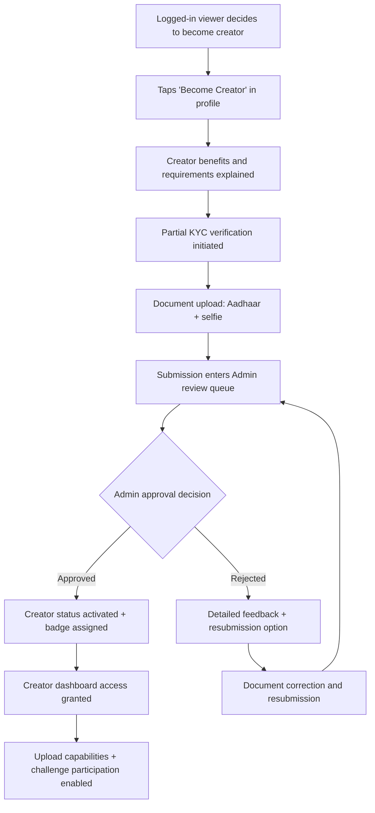
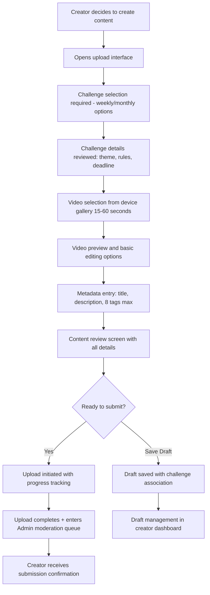
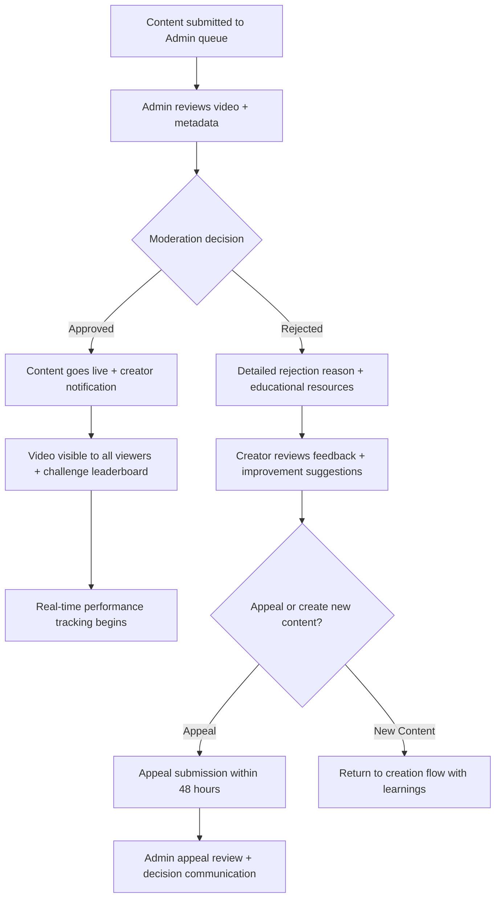
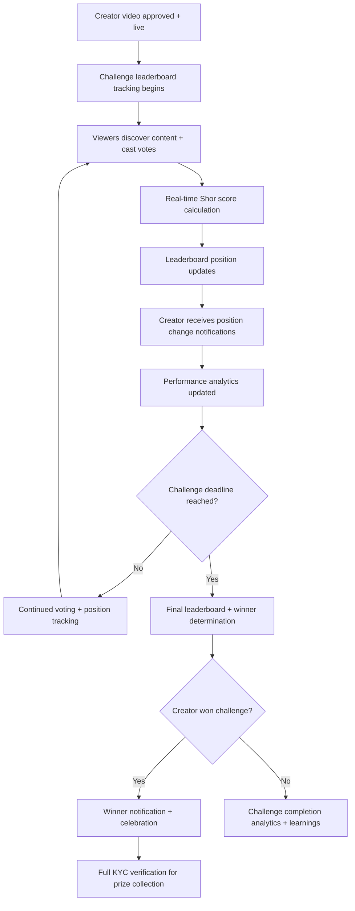
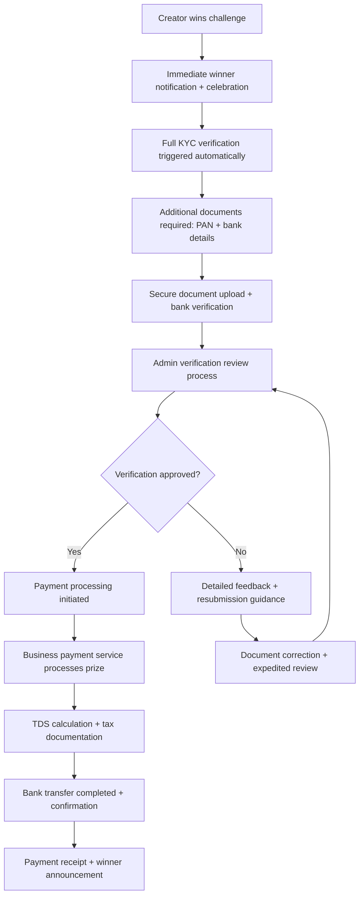
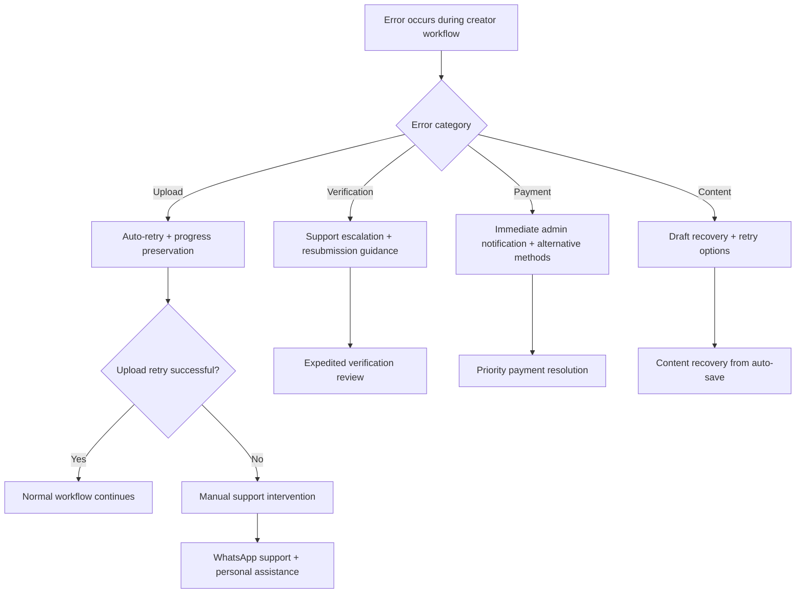

# Dvand - Content Creator User Stories

## User Persona Overview

**Profile:** Aspiring content creators (18-35 years) looking to showcase their talent through creative short-form videos and earn money through platform competitions while building a following.

**Creator Capabilities:**

- **Content Creation**: Upload videos (15-60 seconds, max 2 per challenge)
- **Challenge Participation**: Compete for ₹5,000 weekly and ₹25,000 monthly prizes
- **Audience Building**: Gain followers, track performance analytics, build personal brand
- **Verification Tiers**: Partial KYC for participation, Full KYC for prize collection
- **Enhanced Voting**: Same 50 votes/week as logged-in viewers plus creation privileges

**Primary Motivations:**

- Winning cash prizes through consistent, high-quality content creation
- Building a loyal following and recognition within the creator community
- Developing personal brand through regular challenge participation
- Tracking performance metrics to improve content quality and audience engagement
- Monetizing creative skills in a fair, transparent competition environment

**Success Indicators:**

- Challenge participation rate: 80%+ of active creators participate weekly
- Content approval rate: >90% first-submission approval from moderation
- Audience growth: Average 25+ new followers per month for active creators
- Prize winning: 15% of active creators win at least one challenge annually
- Platform loyalty: 70%+ monthly retention rate for verified creators

---

## 1. Creator Registration & Verification (Priority 1)

### Creator Status Activation

**US-CC-001**: As a logged-in viewer, I want to become a content creator so I can participate in challenges and compete for prizes.

**Acceptance Criteria:**

- "Become Creator" option accessible from profile and main navigation
- Clear value proposition: challenge participation, prize opportunities, audience building tools
- Creator verification requirements explained: partial KYC for participation, full KYC for prizes
- Verification timeline: 24-48 hours for partial KYC review process
- Creator benefits overview: upload capabilities, challenge access, analytics dashboard
- Seamless transition maintaining existing viewer privileges and voting power
- Creator badge assignment upon verification completion

**Cross-User Impact:** Creator registration enters *Admin* KYC verification queue and enables participation in *Admin*-managed challenges

**US-CC-002**: As a new creator, I want to complete partial KYC verification so I can upload videos and participate in challenges.

**Acceptance Criteria:**

- Document requirements: Aadhaar card (front/back), selfie holding Aadhaar
- Secure document upload with progress indicators and format validation
- Document quality guidance: lighting, clarity, angle requirements with examples
- Verification status tracking with email and push notification updates
- Processing timeline: 24-48 hour target with admin review workflow
- Approval enables: video upload, challenge participation, creator dashboard access
- Rejection with specific feedback and guided resubmission process

**Cross-User Impact:** Verification documents reviewed by *Admin* team with standardized approval criteria

**Error Handling:**

- Document upload failure: Auto-retry with progress preservation and alternative upload methods
- Image quality issues: Real-time validation with improvement suggestions before submission
- Verification processing delays: Proactive communication with status updates and timeline estimates
- Resubmission workflow: Clear guidance and expedited review for corrected documents

### Prize Winner Verification

**US-CC-003**: As a challenge winner, I want to complete full KYC verification so I can receive my prize money.

**Acceptance Criteria:**

- Just-in-time verification triggered automatically upon winning announcement
- Additional document requirements: PAN card, bank account details, address proof
- Bank account verification: IFSC validation, account holder name matching with KYC documents
- Tax information collection: PAN verification, TDS deduction explanation
- Processing timeline: 3-5 business days with priority review for winners
- Secure financial data handling with encryption and compliance standards
- Prize disbursement timeline: 5-7 business days post-verification completion

**Cross-User Impact:** Winner verification processed by *Admin* team with prize disbursement through business payment service

**Error Handling:**

- Bank detail mismatches: Clear correction guidance with resubmission workflow
- PAN verification failure: Alternative verification methods and support escalation
- Payment processing delays: Proactive communication and timeline updates
- Document quality issues: Expedited resubmission with dedicated support

---

## 2. Creator Dashboard & Analytics (Priority 1)

### Comprehensive Creator Dashboard

**US-CC-004**: As a verified creator, I want a comprehensive dashboard so I can manage all aspects of my creator journey.

**Acceptance Criteria:**

- Tab-based navigation: Home/Overview, My Content, Active Challenges, Analytics, Earnings, Profile
- Home overview: performance summary, recent activity, challenge opportunities, follower growth
- Quick actions: upload new video, join challenge, view latest analytics
- Notification center: moderation status, challenge updates, follower milestones
- Creator status display: verification level, badges earned, platform tenure
- Goal tracking: monthly upload targets, challenge participation streaks, audience growth
- Creator community: leaderboards, peer recognition, collaboration opportunities

**Cross-User Impact:** Dashboard data reflects *Logged-in Viewer* engagement and *Admin* moderation decisions

**US-CC-005**: As a creator, I want detailed performance analytics so I can understand my content's impact and improve my strategy.

**Acceptance Criteria:**

- Video performance metrics: views, votes received, Shor score progression, engagement rates
- Audience analytics: follower demographics, viewing patterns, geographic distribution
- Challenge performance: leaderboard positions, vote patterns, competitive analysis
- Content analysis: best-performing videos, optimal posting times, theme effectiveness
- Trend tracking: follower growth, engagement evolution, seasonal performance patterns
- Comparative metrics: performance vs. platform averages, peer benchmarking
- Actionable insights: content recommendations, strategic timing, audience preferences

**Cross-User Impact:** Analytics aggregate *Logged-in Viewer* and *Anonymous Viewer* engagement with creator content

**Error Handling:**

- Analytics computation failure: Graceful fallback to cached data with refresh options
- Data synchronization delays: Background updates with user notification when complete
- Export functionality issues: Alternative formats and manual data request options

---

## 3. Content Creation & Upload System (Priority 1)

### Challenge-First Upload Process

**US-CC-006**: As a creator, I want to select a challenge before uploading so my content meets specific requirements and maximizes competition success.

**Acceptance Criteria:**

- Challenge selection as mandatory first step in upload workflow
- Active challenges displayed: weekly (₹5,000), monthly (₹25,000) with deadline countdown
- Challenge details: theme, rules, current participants, submission requirements
- Submission tracker: "Submission 1 of 2 for this challenge" with remaining slots
- Challenge-specific guidelines: content requirements, duration, theme adherence
- Real-time deadline monitoring with warnings for approaching submission cutoffs
- Option to save challenge selection and continue upload process later

**Cross-User Impact:** Challenge selection connects to *Admin*-created competitions with specific themes and rules

**US-CC-007**: As a creator, I want to upload high-quality videos from my device so I can submit compelling content to challenges.

**Acceptance Criteria:**

- Device gallery access with intelligent video filtering (15-60 second duration)
- Format support: MP4, MOV, AVI with automatic format validation
- File size limit: 50MB with compression options for larger files
- Video preview: full playback with trim/edit options before final submission
- Upload progress: detailed progress indicator with pause/resume capability
- Processing status: platform optimization progress with estimated completion time
- Quality preservation: minimal compression while meeting platform standards

**Cross-User Impact:** Uploaded content enters *Admin* moderation queue for approval before going live

**Error Handling - Upload Process:**

- Network interruption: Auto-pause upload with resume capability when connection restored
- File size exceeded: Automatic compression options with quality preview
- Invalid format detection: Format conversion suggestions and alternative upload methods
- Upload timeout: Retry mechanisms with progress preservation and alternative server routing
- Storage failure: Alternative upload paths with user notification and support escalation
- Processing errors: Clear error categorization with specific resolution steps

### Content Metadata & Optimization

**US-CC-008**: As a creator, I want to add comprehensive metadata so my videos are discoverable and engaging for viewers.

**Acceptance Criteria:**

- Video title: required field, 100 character limit with real-time counter
- Description: optional, 500 character limit with hashtag and mention support
- Tag system: maximum 8 tags with auto-suggestions based on content and challenge
- Challenge hashtag: automatically included and non-removable for challenge submissions
- Preview generation: automatic thumbnail selection with manual override option
- SEO optimization: keyword suggestions for improved discoverability
- Content warnings: optional flags for sensitive content with viewer age restrictions

**US-CC-009**: As a creator, I want to save draft videos so I can perfect my submissions before the challenge deadline.

**Acceptance Criteria:**

- Save draft at any point: video upload, metadata entry, or review stage
- Draft management: maximum 5 drafts with oldest auto-deletion when limit exceeded
- Challenge association: drafts linked to specific challenges with deadline reminders
- Auto-save functionality: periodic saving during upload process and metadata entry
- Resume capability: exact restoration of upload progress and entered information
- Expiration warnings: notifications for drafts approaching challenge deadlines
- Draft sharing: optional sharing with trusted collaborators for feedback

**Cross-User Impact:** Draft system enables quality content preparation for *Admin* moderation and *Viewer* engagement

**Error Handling - Draft Management:**

- Auto-save failure: Manual save prompts with local storage backup
- Draft corruption: Recovery options with partial data restoration
- Challenge deadline conflicts: Priority notifications with submission recommendations
- Storage quota exceeded: Draft cleanup guidance with importance ranking

---

## 4. Content Moderation Experience (Priority 1)

### Submission Review Process

**US-CC-010**: As a creator, I want transparent tracking of my content moderation status so I know when my videos will be published.

**Acceptance Criteria:**

- Real-time status indicators: Submitted, Under Review, Approved, Rejected
- Processing timeline: estimated review time with queue position information
- Moderation progress: visual progress bar and current review stage
- Notification system: push/email alerts for status changes with detailed information
- Review criteria: accessible community guidelines with examples and explanations
- Batch status: overview of all submitted content with filterable status views
- Historical tracking: complete moderation history with timestamps and outcomes

**Cross-User Impact:** Moderation status reflects *Admin* review process and determines content visibility to *Viewers*

**US-CC-011**: As a creator, I want constructive feedback on moderation decisions so I can improve my content quality and platform success.

**Acceptance Criteria:**

- Approval notifications: positive reinforcement with performance predictions
- Rejection feedback: specific violation categories with educational resources
- Improvement guidance: actionable suggestions for content enhancement
- Policy education: links to relevant community guidelines and best practices
- Examples provided: successful content examples matching creator's style and challenge theme
- Resubmission guidance: when applicable, clear instructions for content revision
- Support escalation: direct contact options for moderation questions and clarification

**Cross-User Impact:** Moderation feedback improves content quality for enhanced *Viewer* experience

### Content Appeals & Support

**US-CC-012**: As a creator, I want to appeal moderation decisions so I have recourse for disputed content rejections.

**Acceptance Criteria:**

- Appeal window: 48-hour period from rejection notification to maintain fairness
- Appeal form: detailed context field with additional evidence upload capability
- Appeal tracking: status updates and estimated response timeline (24-hour target)
- Review process: human review with original moderator and appeal specialist involvement
- Decision communication: detailed explanation of appeal outcome with reasoning
- Escalation options: WhatsApp support for complex cases requiring human intervention
- Appeal history: complete record of all appeals with outcomes for learning

**Cross-User Impact:** Appeals reviewed by *Admin* team with potential policy clarification for all users

**Error Handling - Moderation Process:**

- Appeal submission failure: Draft preservation with retry mechanism
- Review delay notifications: Proactive communication about extended review times
- Decision delivery failure: Multiple notification channels with confirmation tracking
- Policy interpretation conflicts: Escalation to senior moderators with precedent documentation

---

## 5. Challenge Participation & Competition (Priority 2)

### Active Challenge Management

**US-CC-013**: As a creator, I want comprehensive challenge information so I can make strategic participation decisions and create winning content.

**Acceptance Criteria:**

- Challenge dashboard: all active, upcoming, and completed challenges with performance history
- Detailed challenge briefs: theme explanation, content requirements, judging criteria
- Competition analysis: current leaderboard, top-performing content, vote patterns
- Submission strategy: optimal timing recommendations based on historical data
- Resource library: challenge-specific content ideas, successful examples, creation tips
- Collaboration tools: optional team challenges with creator partnership opportunities
- Performance prediction: AI-driven content scoring with winning probability assessment

**Cross-User Impact:** Challenge information sourced from *Admin* competition management with real-time *Viewer* voting data

**US-CC-014**: As a creator, I want real-time challenge performance tracking so I can understand my competitive position and adjust strategy.

**Acceptance Criteria:**

- Live leaderboard: current position with historical position tracking
- Shor score monitoring: real-time score updates with component breakdown
- Vote analysis: voting patterns, peak engagement times, audience demographic insights
- Competition benchmarking: performance comparison with top competitors
- Engagement metrics: likes, reactions, comments with trend analysis
- Position alerts: notifications for significant leaderboard movement (up or down)
- Strategic insights: recommendations for improving challenge performance

**Cross-User Impact:** Performance data reflects *Logged-in Viewer* and *Anonymous Viewer* voting behavior

### Prize Competition & Winning

**US-CC-015**: As a creator, I want fair and transparent winner selection so I understand how competition outcomes are determined.

**Acceptance Criteria:**

- Judging criteria transparency: Shor score algorithm explanation with component weighting
- Admin discretion: understanding of manual review factors and override capabilities
- Winner announcement: timely notification with celebration and recognition
- Result explanation: detailed breakdown of winning factors and score components
- Community recognition: winner showcasing with achievement badges and profile highlights
- Prize timeline: clear explanation of verification and payment process
- Success factors: analysis of winning content for future strategy development

**Cross-User Impact:** Winner selection managed by *Admin* team based on community voting and algorithmic scoring

**US-CC-016**: As a challenge winner, I want efficient prize collection so I can receive my earnings promptly and continue creating.

**Acceptance Criteria:**

- Winner notification: immediate celebration with prize amount and next steps
- Verification initiation: automatic full KYC process trigger with guided workflow
- Progress tracking: verification status with estimated completion timeline
- Payment processing: transparent timeline with milestone notifications
- Tax documentation: TDS calculation explanation with necessary paperwork
- Payment confirmation: receipt generation and bank account confirmation
- Success celebration: public winner announcement with creator consent and promotion

**Cross-User Impact:** Prize processing handled by *Admin* team with business payment service integration

**Error Handling - Challenge & Prize Process:**

- Leaderboard calculation errors: Manual review triggers with position verification
- Winner verification delays: Proactive communication with timeline updates
- Prize payment failures: Immediate escalation with alternative payment methods
- Competition disputes: Formal review process with evidence consideration

---

## 6. Audience Building & Community (Priority 2)

### Follower Growth & Engagement

**US-CC-017**: As a creator, I want tools to build and engage my audience so I can increase my reach and voting support.

**Acceptance Criteria:**

- Follower analytics: growth tracking, demographics, engagement patterns
- Content strategy: optimal posting recommendations based on follower activity
- Engagement tools: follower notifications, community building features
- Cross-promotion: collaboration opportunities with other creators
- Fan interaction: response tools for comments and reactions with moderation capabilities
- Milestone celebrations: follower count achievements with shareable graphics
- Audience insights: content preferences, viewing habits, voting behavior analysis

**Cross-User Impact:** Follower growth depends on *Logged-in Viewer* following behavior and content quality

**US-CC-018**: As a creator, I want to understand my audience demographics so I can create content that resonates with my followers.

**Acceptance Criteria:**

- Demographic breakdown: age ranges, geographic distribution, platform usage patterns
- Engagement analysis: which content types perform best with specific audience segments
- Viewing behavior: watch time, completion rates, repeat viewing patterns
- Voting support: follower voting behavior and influence on challenge performance
- Growth attribution: understanding how followers discover and engage with content
- Audience comparison: creator's audience vs. platform averages with strategic insights
- Retention metrics: follower loyalty and long-term engagement measurement

**Cross-User Impact:** Audience data aggregated from *Logged-in Viewer* and *Anonymous Viewer* interactions

### Creator Community & Networking

**US-CC-019**: As a creator, I want to connect with other creators so I can learn, collaborate, and build community relationships.

**Acceptance Criteria:**

- Creator directory: searchable database with collaboration interests and specialties
- Networking tools: direct messaging, collaboration proposals, partnership opportunities
- Community forums: creator-only spaces for strategy sharing and platform feedback
- Mentorship programs: experienced creator guidance for newcomers with structured support
- Collaboration challenges: team-based competitions with shared prize opportunities
- Success sharing: case studies and strategy sharing from successful creators
- Platform feedback: direct input channel to admin team for creator experience improvement

**Cross-User Impact:** Creator community strengthens platform content quality and creator retention

**Error Handling - Community Features:**

- Messaging system failures: Alternative communication channels with message queuing
- Collaboration tool errors: Fallback options with manual coordination support
- Community access issues: Support escalation with rapid resolution priority

---

## 7. Content Performance & Optimization (Priority 3)

### Advanced Analytics & Insights

**US-CC-020**: As a creator, I want detailed content performance analysis so I can optimize my strategy for maximum engagement and competition success.

**Acceptance Criteria:**

- Video-level analytics: individual performance metrics with comparative analysis
- Content optimization: A/B testing recommendations for titles, thumbnails, posting times
- Trend analysis: seasonal patterns, viral content factors, audience preference evolution
- Competitive intelligence: anonymous performance benchmarking against similar creators
- ROI analysis: time investment vs. performance outcomes with efficiency recommendations
- Predictive modeling: AI-driven suggestions for content strategy and challenge selection
- Export capabilities: data download for external analysis and strategy planning

**US-CC-021**: As a creator, I want automated insights and recommendations so I can improve my content strategy without extensive manual analysis.

**Acceptance Criteria:**

- Weekly performance reports: automated summaries with key insights and recommendations
- Content scoring: AI-driven quality assessment with improvement suggestions
- Optimal timing: personalized posting schedule recommendations based on audience behavior
- Theme recommendations: trending topics and challenge themes aligned with creator strengths
- Engagement optimization: tactics for increasing votes, likes, and follower growth
- Strategic alerts: notifications about opportunities, trending topics, optimal posting windows
- Success pattern recognition: identification of creator's most effective content strategies

**Cross-User Impact:** Performance optimization benefits from comprehensive *Viewer* engagement data analysis

---

## 8. Monetization & Earnings Management (Priority 3)

### Earnings Tracking & Financial Management

**US-CC-022**: As a creator, I want comprehensive earnings tracking so I can monitor my financial success and plan my content strategy.

**Acceptance Criteria:**

- Earnings dashboard: total earnings, monthly breakdowns, challenge-specific winnings
- Payment history: complete transaction log with reference numbers and tax documentation
- Performance correlation: earnings vs. content quality, consistency, and engagement metrics
- Goal setting: monthly earning targets with progress tracking and strategy recommendations
- Tax documentation: automated TDS calculations with downloadable tax forms
- Payment scheduling: predictable payment timelines with milestone notifications
- Financial insights: ROI analysis for time invested vs. earnings generated

**US-CC-023**: As a creator, I want transparent prize disbursement so I understand the complete payment process from winning to bank account.

**Acceptance Criteria:**

- Prize notification: immediate winner confirmation with amount and timeline
- Verification workflow: step-by-step full KYC process with progress tracking
- Payment processing: detailed timeline with milestone notifications and status updates
- Bank verification: secure account validation with confirmation of payment details
- Tax handling: automatic TDS deduction with explanation and documentation
- Payment confirmation: receipt generation with transaction reference and bank confirmation
- Support integration: dedicated payment support with escalation for issues

**Cross-User Impact:** Payment system managed by *Admin* team with business-grade payment service integration

**Error Handling - Financial Systems:**

- Payment processing delays: Proactive communication with alternative timeline estimates
- Bank verification failures: Multiple verification methods with support guidance
- Tax calculation errors: Manual review triggers with correction notifications
- Payment service outages: Alternative payment methods with priority processing

---

## 9. Profile Management & Personal Branding (Priority 4)

### Creator Profile Optimization

**US-CC-024**: As a creator, I want a compelling profile that showcases my brand so I can attract followers and stand out in competitions.

**Acceptance Criteria:**

- Professional profile builder: bio optimization, portfolio curation, achievement highlights
- Brand consistency: visual identity tools with consistent presentation across platform
- Achievement showcase: badges, win streaks, milestone celebrations with social sharing
- Portfolio management: curated video collections with performance highlighting
- Social integration: external platform linking with cross-promotion capabilities
- Creator verification: tiered verification system (Regular/Silver/Gold) based on achievements
- Analytics integration: profile view tracking with optimization recommendations

**US-CC-025**: As a creator, I want role flexibility so I can enjoy the platform as both a creator and engaged viewer.

**Acceptance Criteria:**

- Seamless mode switching: toggle between creator and viewer interfaces
- Unified experience: consistent navigation and feature access across roles
- Voting capabilities: full voting power (50 votes/week) on other creators' content
- Community participation: ability to support other creators while maintaining creator status
- Notification management: integrated alerts for both creator and viewer activities
- Profile representation: creator badge visible in viewer mode with role clarity
- Analytics consolidation: combined view of creation performance and viewing/voting influence

**Cross-User Impact:** Dual-role functionality enables creators to participate as enhanced *Logged-in Viewers*

---

## User Flow Diagrams

### Flow 1: Creator Registration and Verification Process

### Flow 2: Challenge-First Content Creation and Upload

### Flow 3: Content Moderation and Feedback Loop

### Flow 4: Challenge Competition and Real-Time Performance

### Flow 5: Prize Winning and Payment Process

### Flow 6: Error Recovery and Creator Support

---

## Technical Implementation Requirements

### Content Upload & Processing Pipeline

- **Video Processing**: On-device optimization with quality preservation for 15-60 second content
- **Upload Infrastructure**: Chunked upload with resume capability and progress tracking
- **Format Standardization**: Automatic conversion to platform-optimized formats (MP4 primary)
- **Quality Assurance**: Automated pre-screening with human moderation workflow
- **Storage Architecture**: CDN distribution for optimal global content delivery

### Creator Analytics Engine

- **Real-Time Metrics**: WebSocket connections for live performance tracking
- **Data Aggregation**: Multi-source analytics combining viewer engagement, voting patterns, demographic insights
- **Predictive Modeling**: AI-driven content scoring and strategic recommendations
- **Export Capabilities**: Multiple format data export with privacy compliance
- **Comparative Analysis**: Anonymous benchmarking against platform and peer performance

### Challenge Management System

- **Dynamic Leaderboards**: Real-time ranking updates with Shor score calculation
- **Competition Logic**: Fair voting aggregation with anti-gaming measures
- **Prize Distribution**: Automated winner selection with manual admin override capability
- **Timeline Management**: Challenge lifecycle tracking with automated notifications

### Financial & Payment Infrastructure

- **KYC Verification**: Secure document processing with encrypted storage
- **Payment Integration**: Business-grade payment services (Razorpay/Cashfree) with TDS automation
- **Tax Compliance**: Automated TDS calculation with regulatory documentation
- **Audit Trail**: Complete financial transaction logging for compliance and transparency

---

## Success Metrics & KPIs

### Creator Engagement Excellence

- **Active Creator Rate**: 80%+ of verified creators participate in weekly challenges
- **Content Quality**: >90% first-submission approval rate from moderation
- **Upload Consistency**: Average 3+ video submissions per creator monthly
- **Challenge Participation**: 75%+ creators participate in multiple challenge types
- **Platform Retention**: 70%+ monthly active creator rate with sustained engagement

### Content Performance Standards

- **Approval Efficiency**: <2 hour average moderation time for creator submissions
- **Content Success Rate**: 85%+ of approved videos receive meaningful audience engagement
- **Viral Content Generation**: 10%+ of creator videos achieve trending status monthly
- **Cross-Platform Sharing**: 25%+ of creator content shared externally by viewers

### Financial Success Indicators

- **Prize Distribution**: 100% successful prize payments within 7 business days
- **Creator Earnings**: Average monthly earnings growth of $50-200 for active creators
- **Payment Accuracy**: 99.9%+ payment processing success rate with zero financial errors
- **Tax Compliance**: 100% automated TDS calculation and documentation accuracy

### Community Building Metrics

- **Follower Growth**: Average 25+ new followers monthly for consistently active creators
- **Creator-Viewer Engagement**: 40%+ of creator followers actively vote on their content
- **Community Health**: <2% creator-reported content or payment issues requiring escalation
- **Creator Satisfaction**: 85%+ creator satisfaction rating in quarterly platform surveys

This comprehensive creator experience balances creative freedom with structured competition, providing clear pathways to success while maintaining platform quality and community engagement.
