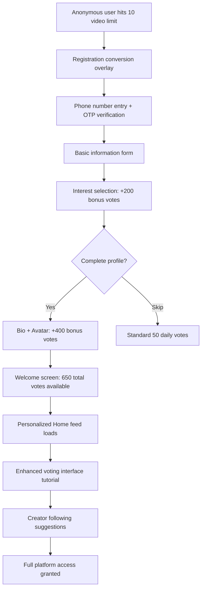
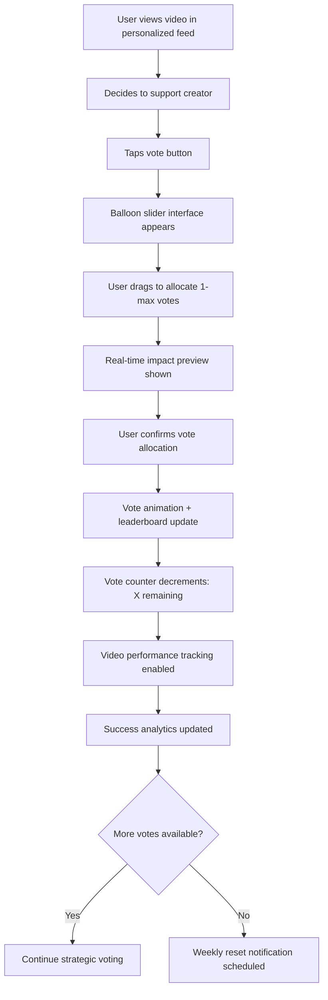
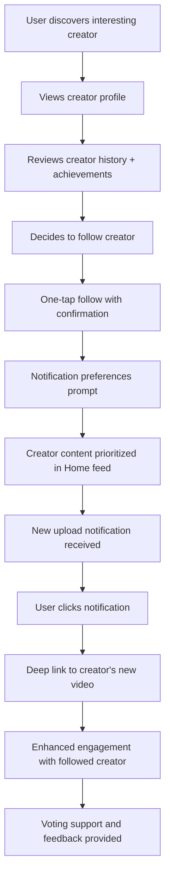
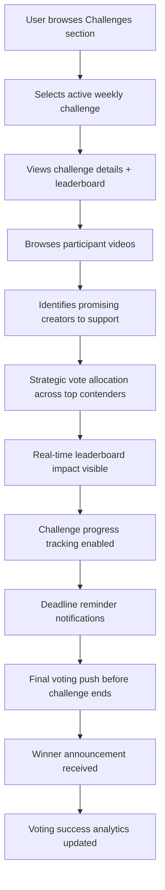
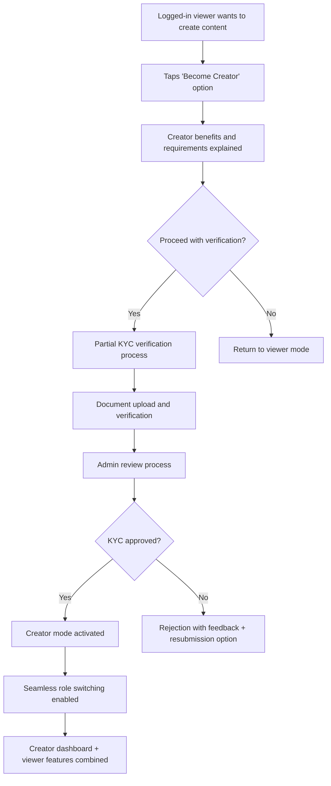
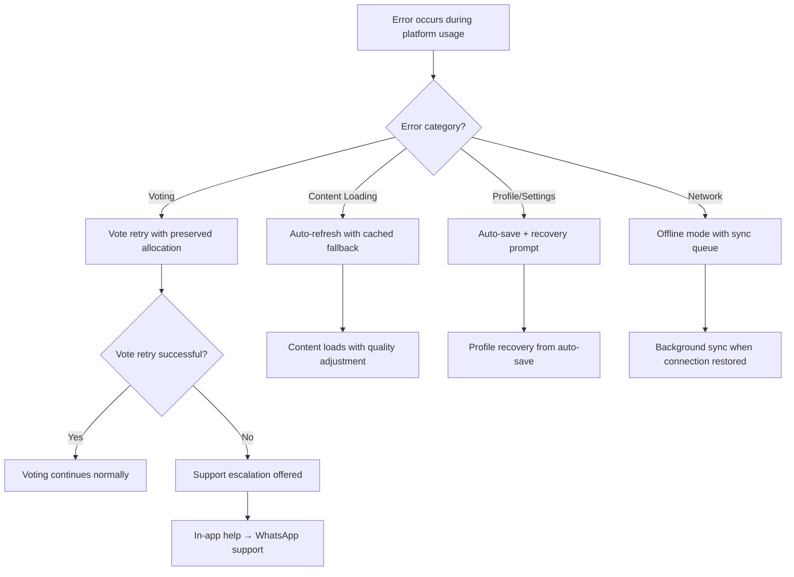

# Dvand - Logged-In Viewer User Stories

## User Persona Overview

**Profile:** Active social media users (18-35 years) who have registered on Dvand and enjoy short-form video content with enhanced voting power to influence contest outcomes.

**Enhanced Capabilities:**

- **Video Viewing**: Unlimited daily access
- **Voting Power**: 50 votes per day with weekly carryover (reset every Monday)
- **Social Features**: Follow creators, receive notifications, full leaderboard access
- **Engagement Tools**: Emoji reactions, content history, performance tracking
- **Platform Influence**: Strategic voting with significant competition impact

**Primary Motivations:**

- Supporting favorite creators with enhanced voting power
- Being part of contest decision-making through strategic voting allocation
- Building connections with creators through following and notifications
- Tracking personal impact on video performance and challenge outcomes
- Discovering high-quality, curated content through personalized feeds

**Engagement Targets:**

- Daily active usage: 18+ minutes average session duration
- Voting engagement: 35+ votes cast per day on average
- Creator following: 8+ follows per active user
- Notification interaction: 35%+ click-through rate
- Return frequency: 5+ days per week platform usage

---

## 1. Registration & Account Enhancement (Priority 1)

### Seamless Registration Experience

**US-LV-001**: As an anonymous viewer who has reached my daily limit, I want to register seamlessly so I can continue watching without interruption.

**Acceptance Criteria:**

- Registration accessible directly from limit screen with compelling messaging
- Single-screen phone number entry with automatic country code detection
- OTP verification with 6-digit code (5-minute expiration, 3 attempts max)
- Immediate access to enhanced features: unlimited viewing + 50 votes daily
- Session preservation: current video position and browsing context maintained
- Welcome screen highlighting new capabilities and bonus vote opportunities
- Automatic upgrade from anonymous session to registered user state

**Cross-User Impact:** Registration creates new account in *Admin* user management system and enables participation in *Creator* content voting

**Error Handling:**

- SMS delivery failure: Voice call OTP option after 60 seconds
- Network timeout: Auto-retry with progress preservation
- Invalid phone format: Real-time validation with format guidance
- OTP entry errors: Clear retry instructions with attempt counter

**US-LV-002**: As a new registered user, I want to complete my profile setup so I can maximize my voting power and personalize my experience.

**Acceptance Criteria:**

- Basic information form: first name, last name, age (18+ verification), username
- Username availability check with real-time suggestions
- Interest selection from curated categories (+200 bonus votes reward)
- Profile completion: bio text field (500 chars) and avatar upload (+400 bonus votes)
- Total possible bonus: 600 votes (added to base 50 daily allocation)
- Progress tracking with clear benefit visualization at each step
- Skip options available but with clear explanation of missed benefits

**Cross-User Impact:** Profile completion affects content personalization algorithm and enables better *Creator* discovery matching

### Account Management & Preferences

**US-LV-003**: As a logged-in viewer, I want to manage my profile information so I control my public presence and privacy settings.

**Acceptance Criteria:**

- Profile editing: name, bio, avatar, username changes (with availability check)
- Privacy controls: profile visibility settings, follower list privacy
- Notification preferences: granular control by category and timing
- Interest updates with immediate feed personalization impact
- Account settings: email preferences, data export options
- Display of creator badge if user has creator status
- Profile analytics: followers, engagement history, platform tenure

**Error Handling:**

- Profile save failure: Auto-draft preservation and retry mechanism
- Avatar upload issues: Format guidance and compression options
- Username conflicts: Real-time suggestions and availability checking

---

## 2. Enhanced Content Discovery & Personalization (Priority 1)

### Personalized Home Feed

**US-LV-004**: As a logged-in viewer, I want a personalized "Home" feed so I see content aligned with my interests and viewing history.

**Acceptance Criteria:**

- Algorithm weighting: Followed creators (40%), Interest alignment (30%), Similar users (20%), Trending factor (10%)
- Real-time feed updates without manual refresh requirement
- Followed creator content prioritized and clearly identified
- Interest-based recommendations with explanation ("Because you liked Dance videos")
- Smooth infinite scroll with intelligent preloading
- Fresh content balance: 70% personalized, 30% trending/discovery
- Feed refresh indicators and "new content available" notifications

**Cross-User Impact:** Feed content sourced from *Creator* submissions approved by *Admin* moderation system

**US-LV-005**: As a logged-in viewer, I want to browse trending content in "Discover" so I stay updated on viral videos and popular challenges.

**Acceptance Criteria:**

- Trending algorithm based on recent engagement velocity and vote surge
- Time-sensitive trending indicators with "trending now" badges
- Mix of viral standalone videos and popular challenge entries
- Category filters: All, Challenges, Dance, Comedy, Talent, etc.
- Geographic trending options: Local, National, Global
- Trending timeframes: Last hour, Today, This week
- Social sharing integration for trending discoveries

**Cross-User Impact:** Trending content reflects *Creator* performance and community voting patterns from all user types

### Challenge Discovery & Engagement

**US-LV-006**: As a logged-in viewer, I want to explore challenges in a dedicated section so I can understand ongoing competitions and make strategic voting decisions.

**Acceptance Criteria:**

- Current challenges with live leaderboards and real-time updates
- Challenge details: theme, rules, prize amount (₹5,000 weekly/₹25,000 monthly), deadline
- Participant video feeds organized by challenge with filtering options
- Upcoming challenges with countdown timers and notification signup
- Previous challenges with winner announcements and video archives
- Challenge statistics: participation count, total votes cast, engagement metrics
- Strategic voting opportunities highlighted with impact predictions

**Cross-User Impact:** Challenge information managed by *Admin*, leaderboards reflect *Creator* submissions and voting from all registered users

**Error Handling:**

- Leaderboard loading failure: Cached data display with refresh option
- Challenge detail fetch error: Fallback to basic information with retry
- Real-time update interruption: Background sync with update notification

---

## 3. Enhanced Voting & Strategic Engagement (Priority 1)

### Advanced Voting System

**US-LV-007**: As a logged-in viewer, I want enhanced voting power so I can have meaningful influence on competition outcomes.

**Acceptance Criteria:**

- Daily allocation: 50 votes with carryover to next day (unused votes preserved)
- Weekly reset: All votes (used and unused) reset every Monday at midnight
- Balloon slider interface: allocate 1 to maximum available votes per video
- Real-time impact preview: shows how vote allocation affects leaderboard position
- Vote confirmation with satisfying animation and impact visualization
- Strategic voting analytics: track influence on challenge outcomes and creator success
- Vote history tracking with performance impact measurement

**Cross-User Impact:** Enhanced voting directly influences *Creator* video performance and challenge leaderboard positions

**US-LV-008**: As a logged-in viewer, I want to track my voting impact so I understand how I influence competitions and creator success.

**Acceptance Criteria:**

- Vote history with amounts allocated per video and current video performance
- Success tracking for videos supported: leaderboard progression, final rankings
- Creator success rate statistics when supported by user votes
- Voting influence analytics: percentage contribution to video success
- Challenge outcome tracking: wins/losses for supported creators
- Voting pattern analysis with strategic recommendations
- Achievement badges for successful voting support and prediction accuracy

**Cross-User Impact:** Voting impact tracking shows real influence on *Creator* success and *Admin*-managed competition outcomes

### Rich Engagement Options

**US-LV-009**: As a logged-in viewer, I want multiple ways to express reactions so I can provide nuanced feedback beyond voting.

**Acceptance Criteria:**

- Standard like/dislike buttons with visible counts (affects Shor score)
- 10 emoji reaction options: 😍❤️🔥👏😂🤔👍🎉💯⭐ (visual feedback only)
- Quick reaction interface positioned near video player for easy access
- Reaction counts visible to all users with reaction type breakdown
- Reaction history tracking in user profile with content reference
- Bulk reaction capabilities for efficient engagement across multiple videos
- Reaction-based content recommendations ("More videos you might love")

**Cross-User Impact:** Reactions provide feedback to *Creators* and influence content recommendation algorithms

**Error Handling:**

- Reaction processing failure: Visual feedback retry with confirmation
- Network timeout: Queue reactions for background sync
- Simultaneous reaction conflicts: Last action takes precedence with notification

---

## 4. Creator Following & Social Features (Priority 2)

### Creator Discovery & Following

**US-LV-010**: As a logged-in viewer, I want to follow my favorite creators so I receive priority access to their content and updates.

**Acceptance Criteria:**

- One-tap follow/unfollow with immediate visual confirmation
- Followed creators' content prioritized in Home feed with clear identification
- Creator content notifications: new uploads, challenge participation, wins
- Following count displayed on creator profiles with mutual follow indicators
- Following list management in user profile with search and categorization
- Creator activity summaries: recent uploads, challenge participation, achievements
- Follower milestone celebrations and creator appreciation features

**Cross-User Impact:** Following behavior provides valuable data for *Creator* audience insights and *Admin* platform analytics

**US-LV-011**: As a logged-in viewer, I want to view detailed creator profiles so I can make informed following and voting decisions.

**Acceptance Criteria:**

- Comprehensive creator information: bio, verification status, follower count, total videos
- Complete video gallery organized by recency with filtering options
- Challenge participation history: entries, wins, earnings, performance metrics
- Creator badges and achievements: verification levels, win streaks, community recognition
- Social links and external profile connections if provided by creator
- Creator statistics: average Shor scores, engagement rates, content consistency
- Follow/unfollow button prominent with notification preferences integration

**Cross-User Impact:** Profile views provide engagement metrics for *Creators* and inform *Admin* creator success tracking

### Notification Management

**US-LV-012**: As a logged-in viewer, I want configurable notifications so I stay informed about relevant platform activity without notification fatigue.

**Acceptance Criteria:**

- Notification categories: Followed creators, Challenge updates, Trending content, Platform announcements
- Granular control: per-category on/off, timing preferences, frequency limits
- Push notification integration with deep linking to specific content
- In-app notification center with history and action options
- Batch notifications to prevent spam: multiple updates combined intelligently
- Quiet hours configuration with emergency override options
- Notification effectiveness tracking and personalized optimization

**Cross-User Impact:** Notification engagement drives traffic to *Creator* content and supports *Admin* platform engagement goals

**Error Handling:**

- Notification delivery failure: Fallback to in-app notification center
- Deep link malfunction: Graceful fallback to relevant platform sections
- Notification overload: Automatic batching and frequency adjustment

---

## 5. Content History & Personal Analytics (Priority 2)

### Engagement History Management

**US-LV-013**: As a logged-in viewer, I want to track my engagement history so I can revisit content and monitor my platform activity.

**Acceptance Criteria:**

- Organized tabs: Liked videos, Voted content, Reaction history, Followed creators
- Search functionality within personal history with filters and sorting
- Content removal options for privacy with bulk selection capability
- Viewing history with timestamps and engagement summary
- Export functionality for personal data with multiple format options
- Privacy controls for engagement visibility and sharing
- History synchronization across devices with cloud backup

**US-LV-014**: As a logged-in viewer, I want personal analytics so I understand my engagement patterns and platform influence.

**Acceptance Criteria:**

- Voting influence statistics: success rate, impact measurement, creator wins supported
- Engagement pattern analysis: peak activity times, content preferences, viewing habits
- Following impact tracking: how followed creators perform relative to platform average
- Achievement system: voting accuracy, early trend detection, creator support consistency
- Comparative analytics: personal stats vs. platform averages
- Historical trend visualization: engagement evolution over time
- Actionable insights and recommendations for strategic platform participation

**Cross-User Impact:** Personal analytics aggregate into platform insights for *Admin* user behavior analysis

**Error Handling:**

- Analytics computation failure: Graceful fallback to basic statistics
- Data synchronization issues: Local cache with background sync recovery
- Export functionality errors: Alternative format options and retry mechanisms

---

## 6. Social Sharing & Platform Growth (Priority 3)

### Advanced Sharing Capabilities

**US-LV-015**: As a logged-in viewer, I want enhanced sharing options so I can promote favorite content and creators effectively.

**Acceptance Criteria:**

- Standard social media sharing with customizable messages and creator attribution
- Direct creator support messaging: "Check out @creator on Dvand - they're competing for ₹25,000!"
- Share tracking: monitor reach and conversion of shared content
- Challenge-specific sharing: include contest context and voting calls-to-action
- QR code generation for offline sharing and creator support
- Deep linking with personalized referral codes for growth tracking
- Batch sharing capabilities for multiple videos or creator profiles

**Cross-User Impact:** Sharing drives growth for *Creators* and brings new users into platform ecosystem

**US-LV-016**: As a logged-in viewer, I want to share my voting achievements so I can demonstrate my platform influence and encourage participation.

**Acceptance Criteria:**

- Achievement sharing: successful predictions, creator wins supported, voting milestones
- Shareable analytics: personal influence statistics, voting success rate, platform tenure
- Social proof generation: "I helped 5 creators win prizes on Dvand this month!"
- Privacy controls: choose what achievements are shareable publicly
- Platform branding: consistent visual design for shared achievements
- Viral mechanics: achievement sharing that encourages new user registration
- Creator appreciation: share support for specific creators with attribution

**Cross-User Impact:** Achievement sharing provides social proof for platform credibility and *Creator* success stories

---

## 7. Role Switching & Creator Pathway (Priority 3)

### Creator Mode Access

**US-LV-017**: As a logged-in viewer interested in content creation, I want easy access to creator features so I can participate in challenges.

**Acceptance Criteria:**

- "Become Creator" option accessible from profile and main navigation
- Clear explanation of creator benefits: challenge participation, prize opportunities, audience building
- Creator verification requirements: partial KYC process overview with timeline
- Progress tracking through verification with status updates
- Creator feature preview: dashboard mockups, upload interface, analytics examples
- Seamless transition maintaining viewer privileges and history
- Support channel integration for creator onboarding questions

**Cross-User Impact:** Creator conversion creates new participants for *Admin*-managed challenges

**US-LV-018**: As a logged-in viewer who is also a verified creator, I want seamless role switching so I can access appropriate features for each role.

**Acceptance Criteria:**

- "Create" tab or mode switcher in main navigation
- Seamless transition between viewer and creator interfaces
- Unified notification system across both roles
- Creator badge visible in viewer profile and interactions
- Shared analytics: viewing influence + creation performance
- Voting power maintained: can vote on other creators' content
- Role-specific features clearly delineated with context switching

**Cross-User Impact:** Dual-role users contribute both as *Creators* and enhanced voters in platform ecosystem

**Error Handling:**

- Role switching failure: Graceful fallback with error explanation
- Feature access conflicts: Clear role requirement messaging
- Verification status confusion: Real-time status display with help options

---

## 8. Platform Safety & Content Quality (Priority 4)

### Content Reporting & Moderation

**US-LV-019**: As a logged-in viewer, I want to report problematic content so I can contribute to platform safety and quality.

**Acceptance Criteria:**

- Comprehensive reporting system: inappropriate content, spam, copyright violation, harassment
- Detailed report categories with description fields and evidence upload
- Reporter protection: anonymous reporting with optional contact information
- Report status tracking: submission confirmation, review progress, resolution outcome
- Community guidelines integration: clear explanation of platform standards
- Bulk reporting capabilities for systematic violations
- Reporter feedback system: impact of reports on content moderation

**Cross-User Impact:** Reports feed into *Admin* moderation queue for *Creator* content review and platform safety

**US-LV-020**: As a logged-in viewer, I want transparency in content moderation so I understand how platform safety is maintained.

**Acceptance Criteria:**

- Community guidelines easily accessible with examples and explanations
- Moderation transparency: general statistics on content review and enforcement
- Appeal process information: how creators can contest moderation decisions
- Safety feature explanations: how reporting works, response timelines
- Platform policy updates: notifications about guideline changes with rationale
- Safety statistics: percentage of content requiring action, response times
- User safety tools: blocking, muting, content filtering options

**Cross-User Impact:** Transparency builds trust in *Admin* moderation processes and *Creator* content quality

---

## User Flow Diagrams

### Flow 1: Registration and Enhanced Feature Discovery

### Flow 2: Strategic Voting and Impact Tracking

### Flow 3: Creator Following and Content Discovery

### Flow 4: Challenge Engagement and Competition Participation

### Flow 5: Role Switching to Creator Mode

### Flow 6: Error Recovery and Support Integration

---

## Technical Implementation Requirements

### Enhanced Voting System Architecture

- **Vote Allocation**: Balloon slider with smooth drag interaction and haptic feedback
- **Carryover Logic**: Daily unused votes accumulate until weekly Monday reset
- **Impact Calculation**: Real-time leaderboard position prediction with vote allocation
- **Analytics Pipeline**: Vote tracking with creator success correlation analysis
- **Performance**: Sub-second vote processing with optimistic UI updates

### Personalization Engine

- **Algorithm Weights**: Followed creators (40%), interests (30%), similar users (20%), trending (10%)
- **Real-time Updates**: WebSocket connections for live feed updates
- **Content Scoring**: Multi-factor ranking with user behavior integration
- **A/B Testing**: Personalization algorithm optimization with user experience metrics
- **Privacy Protection**: User data handling with consent management

### Social Features Infrastructure

- **Following System**: Scalable creator-follower relationships with notification triggers
- **Notification Service**: Multi-channel delivery (push, in-app, email) with preference management
- **Analytics Integration**: User behavior tracking with privacy compliance
- **Deep Linking**: Universal links for seamless notification-to-content navigation
- **Social Sharing**: Rich link previews with tracking and attribution

### Cross-Platform Synchronization

- **Account Sync**: Real-time synchronization across mobile and web platforms
- **Offline Capability**: Essential features functional without network connectivity
- **Data Consistency**: Conflict resolution for simultaneous multi-device usage
- **Performance Optimization**: Intelligent caching and background synchronization
- **Security**: JWT token management with automatic refresh and secure storage

---

## Success Metrics & KPIs

### Engagement Excellence

- **Daily Active Users**: Target 20,000+ logged-in users with 18+ minute sessions
- **Voting Engagement**: 35+ votes cast per user daily (70% of available allocation)
- **Creator Following**: 8+ follows per active user with 80% notification engagement
- **Content Completion**: 75%+ videos watched to completion in personalized feeds
- **Session Frequency**: 5+ days per week platform usage with consistent engagement

### Strategic Voting Impact

- **Vote Allocation Efficiency**: Average 25 votes per user per day (strategic distribution)
- **Creator Success Correlation**: Track voting influence on challenge outcomes
- **Leaderboard Impact**: Measure vote allocation effect on position changes
- **Strategic Accuracy**: User prediction success rate for challenge winners
- **Community Influence**: Collective voting impact on platform content quality

### Social Features Performance

- **Following Growth**: 15% monthly increase in creator-follower relationships
- **Notification Engagement**: 35%+ click-through rate across all notification types
- **Sharing Activity**: 20% of users share content monthly with 3+ shares per sharing user
- **Profile Completion**: 80%+ users complete full profile for maximum voting power
- **Role Switching**: 15% of active viewers explore creator mode annually

### Platform Loyalty Indicators

- **Weekly Retention**: 70%+ of new users active in week 2
- **Monthly Retention**: 50%+ of users active in month 2
- **Feature Adoption**: 90%+ of users utilize enhanced voting within first week
- **Creator Support**: Average 12+ creators followed per highly engaged user
- **Long-term Engagement**: 6+ month user tenure with sustained activity levels

This comprehensive logged-in viewer experience balances enhanced capabilities with strategic platform participation, creating a compelling value proposition that justifies registration while supporting creator success and platform growth.
