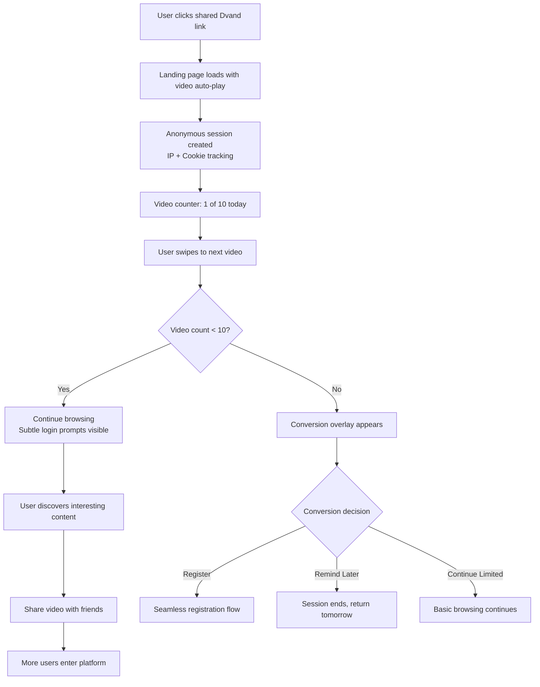
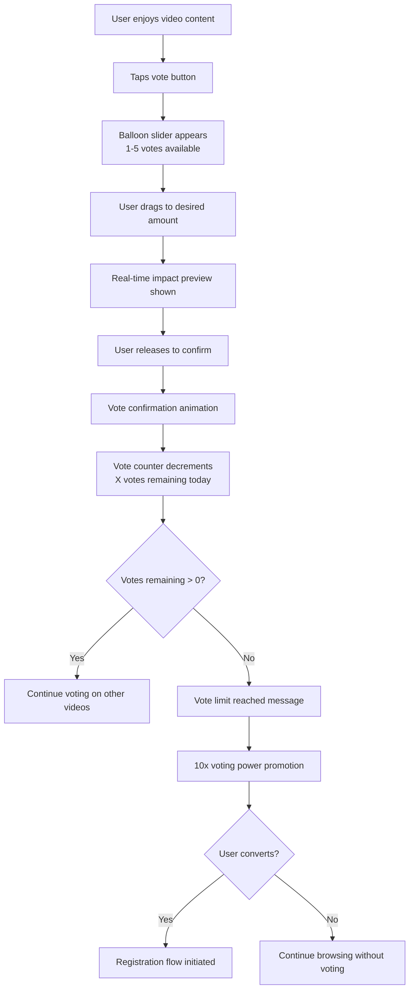
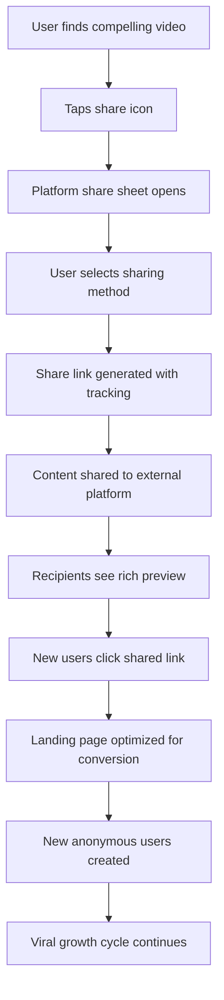
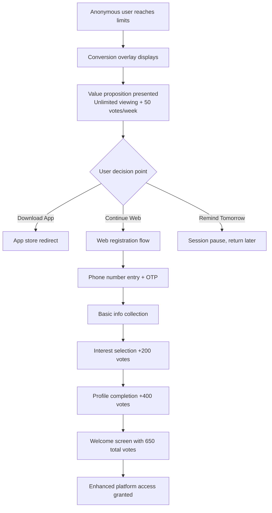
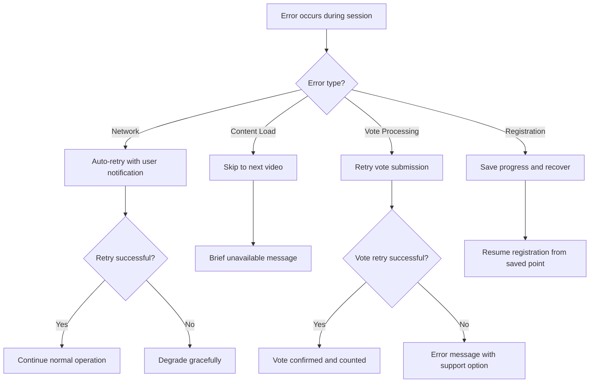

# Dvand - Non-Logged-In Viewer User Stories

## User Persona Overview

**Profile:** First-time visitors and casual browsers (18-35 years) discovering Dvand through social media shares, direct links, or web search results.

**Access Capabilities:**

- **Video Viewing**: 10 videos per 24-hour period
- **Voting Power**: 5 votes per day (daily reset, no carryover)
- **Content Interaction**: Basic viewing and voting only
- **Session Tracking**: IP-based with browser cookie fallback

**Primary Goals:**

- Evaluate platform content quality and entertainment value
- Understand the competition structure and creator ecosystem
- Discover if the platform warrants account registration
- Share interesting content with friends and social networks

**Conversion Targets:**

- Registration conversion rate: 25%+ of anonymous users
- Engagement depth: Average 6+ videos viewed per session
- Social sharing: 15%+ of anonymous users share content externally

**Platform Entry Points:**

- Social media shares (primary)
- Direct links from creators
- Web search results
- External promotions and marketing

---

## 1. Platform Entry & Initial Experience

### First-Time Platform Access

**US-NLV-001**: As a first-time visitor, I want seamless access to trending content so I can immediately understand the platform's value proposition.

**Acceptance Criteria:**

- Direct video playback without registration barriers
- Auto-play of shared content with minimal UI clutter
- Trending algorithm prioritizing high-engagement content (70% trending, 30% new)
- Immediate access to basic platform navigation
- Session creation with anonymous user tracking (IP + cookie)
- Clear visual branding and platform identity
- Smooth video loading on 4G networks (<3 second start time)

**Cross-User Impact:** Content displayed comes from *Creator submissions* that have been *Admin-approved* through moderation

**US-NLV-002**: As an anonymous viewer, I want intuitive navigation between videos so I can browse content effortlessly.

**Acceptance Criteria:**

- Vertical swipe or slide up/down for next/previous videos
- Minimal UI elements maximizing content viewing area
- Smooth transitions between videos with preloading
- Video progress indicator and basic playback controls
- Simple tap-to-pause/play functionality
- Navigation that works consistently across different content types
- Auto-advance to next video after completion

**Error Handling:**

- Network timeout: Auto-retry with "Connection issue. Retrying..." message
- Video load failure: Skip to next video with brief "Video unavailable" notice
- Slow connection: Automatic quality adjustment with "Optimizing for your connection"

### Content Discovery & Browsing

**US-NLV-003**: As an anonymous viewer, I want to see high-quality, engaging content first so I'm motivated to explore further.

**Acceptance Criteria:**

- Algorithm showcasing platform's best content to new users
- Mix of challenge entries and standalone creative videos
- Content freshness balanced with proven engagement
- Automatic filtering of admin-rejected or low-quality content
- Visual indicators for challenge participation content
- Creator verification badges visible for credibility
- Content diversity across different themes and styles

**Cross-User Impact:** Content quality depends on *Creator* submissions and *Admin* moderation efficiency

**US-NLV-004**: As an anonymous viewer, I want to understand ongoing challenges so I can see what the platform competition structure offers.

**Acceptance Criteria:**

- Challenge information visible on relevant videos
- Basic challenge details: theme, prize amount, deadline
- Current leaderboard glimpse (top 3 positions only)
- Challenge participation statistics (e.g., "147 creators participating")
- Visual distinction between weekly (₹5,000) and monthly (₹25,000) challenges
- Clear indication that challenge participation requires registration
- Promotional messaging about prize opportunities

**Cross-User Impact:** Challenge information managed by *Admin*, leaderboard reflects *Creator* submissions and *Logged-in Viewer* voting

---

## 2. Voting & Engagement System

### Limited Voting Capability

**US-NLV-005**: As an anonymous viewer, I want to vote on videos I enjoy so I can support creators within my daily limit.

**Acceptance Criteria:**

- 5 votes per day with IP-based tracking
- Balloon slider interface for vote allocation (1-5 votes per video)
- Visual vote counter: "X votes remaining today" prominently displayed
- Vote impact preview showing effect on video's performance
- Satisfying confirmation animation when votes are cast
- Clear messaging when daily vote limit is reached
- Vote allocation resets at midnight (no carryover)
- Anti-gaming measures for IP-based vote manipulation

**Cross-User Impact:** Votes contribute to *Creator* video Shor scores and challenge leaderboard positions

**US-NLV-006**: As an anonymous viewer, I want to see the voting power difference so I understand the benefit of registration.

**Acceptance Criteria:**

- Clear comparison: "Anonymous: 5 votes/day | Registered: 50 votes/day"
- Visual representation of voting power limitation
- Regular reminders of enhanced capabilities with account
- Vote power comparison in context of video impact
- Success stories or testimonials from registered users
- Progressive disclosure of registration benefits
- Compelling messaging: "Get 10x voting power with free registration!"

**Error Handling:**

- Vote processing failure: "Vote didn't register. Please try again."
- Network timeout during voting: Auto-retry with user notification
- Daily limit reached: Smooth transition to registration conversion prompt
- Multiple device detection: "You've reached your daily limit across all devices"

### Engagement Limitations & Conversion Triggers

**US-NLV-007**: As an anonymous viewer, I want clear indication of feature limitations so I understand what registration unlocks.

**Acceptance Criteria:**

- Features visible but disabled with explanatory tooltips
- "Login required" indicators on advanced features
- Disabled functions: emoji reactions, creator following, full leaderboards
- Preview of enhanced capabilities with visual mockups
- Progressive feature revelation during browsing session
- Benefit-focused messaging rather than limitation-focused
- Social proof elements showing registered user engagement

**Cross-User Impact:** Feature previews show activities from *Logged-in Viewers* and *Creator* interactions

---

## 3. Content Sharing & Viral Distribution

### Social Media Integration

**US-NLV-008**: As an anonymous viewer, I want to share interesting videos with friends so I can spread content I enjoy without registering.

**Acceptance Criteria:**

- Share button accessible on all videos
- Platform share sheet with popular options (WhatsApp, Instagram, Facebook, Twitter)
- Copy link functionality with tracking parameters
- Share URL includes video preview and platform branding
- Custom share messages with video context
- Share analytics tracking for platform growth measurement
- QR code generation for offline sharing scenarios

**Cross-User Impact:** Shared content drives new anonymous users to platform, increasing *Creator* reach

**US-NLV-009**: As an anonymous viewer, I want shared content to provide context so recipients understand the platform value.

**Acceptance Criteria:**

- Rich link previews with video thumbnail and title
- Challenge context included in shared content
- Creator information and verification status
- Platform branding and value proposition in share preview
- Direct landing page optimized for new user conversion
- Share tracking with attribution to original viewer
- Viral coefficient measurement and optimization

**Error Handling:**

- Share failure: Alternative sharing methods offered
- Link generation error: Fallback to basic URL sharing
- Social platform unavailable: "Try copying link instead"

---

## 4. Conversion & Registration Flow

### Daily Limit Management

**US-NLV-010**: As an anonymous viewer approaching my daily limits, I want clear progression indicators so I can plan my engagement.

**Acceptance Criteria:**

- Video counter: "Video 7 of 10 for today"
- Vote counter: "3 votes remaining today"
- Progress visualization with subtle urgency indicators
- Gentle reminder notifications as limits approach
- No abrupt content blocking - gradual conversion messaging
- Clear reset time display: "Limits reset in 8 hours"
- Option to continue with reduced functionality

**US-NLV-011**: As an anonymous viewer who has reached my limits, I want compelling conversion messaging so I understand the value of registration.

**Acceptance Criteria:**

- Full-screen overlay with clear value proposition
- "Unlock unlimited viewing + 10x voting power" messaging
- Visual comparison of anonymous vs registered capabilities
- Social proof: user testimonials, platform statistics
- Multiple conversion paths: "Download App", "Continue on Web", "Register Now"
- "Remind me tomorrow" option to avoid user frustration
- Conversion tracking and A/B testing capability

**Cross-User Impact:** Successful conversion creates new *Logged-in Viewer* with enhanced voting power affecting *Creator* competition outcomes

### Registration Funnel Optimization

**US-NLV-012**: As an anonymous viewer ready to register, I want a seamless signup process so conversion friction is minimized.

**Acceptance Criteria:**

- Single-screen phone number entry with country code detection
- OTP verification with SMS/voice call fallback options
- Basic information collection: name, age, username
- Interest selection with immediate personalization (+200 bonus votes)
- Profile completion incentive (+400 bonus votes)
- Progress indicators showing conversion benefits
- Immediate access to enhanced features post-registration

**Cross-User Impact:** New registration creates *Logged-in Viewer* account, potentially leading to *Creator* status later

**Error Handling:**

- Phone number validation: Real-time format checking
- OTP delivery failure: Alternative delivery methods offered
- Username availability: Real-time checking with suggestions
- Registration timeout: Session preservation and recovery
- Network interruption: Auto-save progress and resume capability

---

## 5. Session Management & Tracking

### Anonymous User Identification

**US-NLV-013**: As an anonymous viewer returning to the platform, I want my previous activity recognized so I don't immediately hit limits again.

**Acceptance Criteria:**

- Hybrid tracking: Browser cookies (primary), IP address (secondary)
- Device fingerprinting (browser, OS, screen size) as fallback
- 7-day cookie expiration with reasonable session persistence
- Recognition of returning users without privacy violation
- Graceful handling of cleared cookies or changed IPs
- Activity attribution across multiple sessions
- Privacy-compliant tracking mechanisms

**US-NLV-014**: As an anonymous viewer, I want my daily limits properly tracked so I receive fair access to platform features.

**Acceptance Criteria:**

- Accurate 24-hour rolling window for video and vote limits
- Cross-device limit enforcement to prevent gaming
- Clear reset timing with user notification
- Backup tracking methods when primary fails
- Anti-abuse measures for VPN/proxy usage
- Consistent limit application across different entry points
- Transparent limit tracking without exposing technical details

**Error Handling:**

- Cookie clearing detection: Graceful degradation to IP tracking
- Multiple device detection: Fair limit distribution across devices
- VPN/Proxy detection: Standard limits apply without blocking
- Tracking failure: Conservative limit application for user benefit

---

## 6. Platform Familiarization & Education

### Understanding Platform Mechanics

**US-NLV-015**: As an anonymous viewer, I want to understand how the platform works so I can appreciate the competition structure.

**Acceptance Criteria:**

- Subtle educational elements throughout the experience
- Challenge explanation overlays on relevant content
- Voting impact visualization and leaderboard previews
- Creator journey explanation with success stories
- Prize structure and winner selection transparency
- Platform rules and community guidelines accessible
- FAQ integration for common questions

**Cross-User Impact:** Understanding enhances appreciation of *Creator* efforts and *Admin* platform management

**US-NLV-016**: As an anonymous viewer, I want to see platform credibility indicators so I trust the competition legitimacy.

**Acceptance Criteria:**

- Winner announcements and payment confirmations visible
- Creator verification badges and achievement displays
- Transparent challenge rules and judging criteria
- Community testimonials and success stories
- Platform statistics: total creators, prizes distributed, active users
- Professional presentation and consistent branding
- Legal compliance and terms of service accessibility

**Cross-User Impact:** Credibility built through visible *Admin* management and successful *Creator* prize distributions

---

## 7. Content Quality & Safety

### Safe Browsing Experience

**US-NLV-017**: As an anonymous viewer, I want high-quality, appropriate content so my platform experience is positive.

**Acceptance Criteria:**

- Content pre-filtered through admin moderation system
- Community guidelines enforcement visible through content quality
- Age-appropriate content with proper classification
- Cultural sensitivity in content curation
- Quick reporting mechanism for inappropriate content
- Safe browsing without explicit or harmful material
- Quality standards evidenced through content selection

**Cross-User Impact:** Content quality managed by *Admin* moderation of *Creator* submissions

**US-NLV-018**: As an anonymous viewer, I want to report problematic content so I can contribute to platform safety.

**Acceptance Criteria:**

- Simple report button accessible on all videos
- Report categories: inappropriate content, spam, copyright violation
- Anonymous reporting without registration requirement
- Confirmation of report submission with tracking reference
- Community guidelines reference for context
- Follow-up mechanism for severe violations
- Reporter protection and privacy

**Cross-User Impact:** Reports escalated to *Admin* moderation queue for *Creator* content review

**Error Handling:**

- Report submission failure: Retry mechanism with confirmation
- Network timeout during reporting: Queued submission when connection restored
- Invalid report detection: Educational guidance on appropriate reporting

---

## User Flow Diagrams

### Flow 1: Initial Platform Entry and Content Discovery

### Flow 2: Voting Experience and Limit Management

### Flow 3: Content Sharing and Viral Distribution

### Flow 4: Registration Conversion Journey

### Flow 5: Error Recovery and Support

---

## Technical Implementation Requirements

### Session Tracking Architecture

- **Primary Tracking**: HTTP-only cookies with 7-day expiration
- **Secondary Tracking**: IP-based identification with geo-location
- **Tertiary Tracking**: Basic device fingerprinting (non-invasive)
- **Privacy Compliance**: GDPR-style consent and data protection
- **Anti-Gaming**: Cross-device detection and reasonable limit enforcement

### Content Delivery Optimization

- **Video Loading**: Progressive loading with quality adaptation
- **Caching Strategy**: CDN optimization for anonymous user experience
- **Performance Targets**: <3 second video start time on 4G networks
- **Bandwidth Management**: Automatic quality adjustment for poor connections
- **Offline Capability**: Basic caching for recently viewed content

### Conversion Funnel Analytics

- **Tracking Points**: Entry source, engagement depth, conversion triggers
- **A/B Testing**: Conversion messaging and timing optimization
- **Success Metrics**: 25% registration conversion rate target
- **User Journey**: Complete funnel analysis from entry to conversion
- **Attribution**: Source tracking for marketing and growth optimization

### Security & Safety Measures

- **Rate Limiting**: API protection against abuse and scraping
- **Content Filtering**: Pre-moderated content only for anonymous users
- **Report Processing**: Anonymous reporting with admin escalation
- **Data Protection**: Minimal data collection with secure handling
- **Bot Detection**: Automated traffic identification and filtering

---

## Success Metrics & KPIs

### Engagement Metrics

- **Session Duration**: Target 12+ minutes average per anonymous session
- **Video Consumption**: Average 6+ videos viewed per session
- **Voting Engagement**: 80%+ of anonymous users cast at least one vote
- **Return Rate**: 40%+ of anonymous users return within 7 days
- **Share Rate**: 15%+ of anonymous users share content externally

### Conversion Metrics

- **Registration Rate**: 25%+ conversion from anonymous to registered
- **Conversion Timing**: Track optimal points for conversion messaging
- **Funnel Analysis**: Minimize drop-off at each conversion step
- **Source Attribution**: Identify highest-converting traffic sources
- **Cost Per Acquisition**: Optimize marketing spend through anonymous experience

### Content Discovery Metrics

- **Content Completion**: 70%+ videos watched to completion
- **Browse Depth**: Average progression through 8+ videos per session
- **Content Preference**: Track content types driving highest engagement
- **Challenge Interest**: Measure challenge-related content engagement
- **Quality Indicators**: Low skip rates and high vote allocation

### Platform Health Indicators

- **Technical Performance**: <3 second load times, >99% uptime
- **Content Safety**: <1% reported content rate requiring action
- **User Satisfaction**: Positive sentiment in sharing behavior
- **Growth Velocity**: Week-over-week increase in anonymous users
- **Viral Coefficient**: Users brought per anonymous user sharing

This updated document provides comprehensive coverage of the anonymous viewer experience while maintaining clear cross-references to other user types and integrated error handling throughout each functional area.
